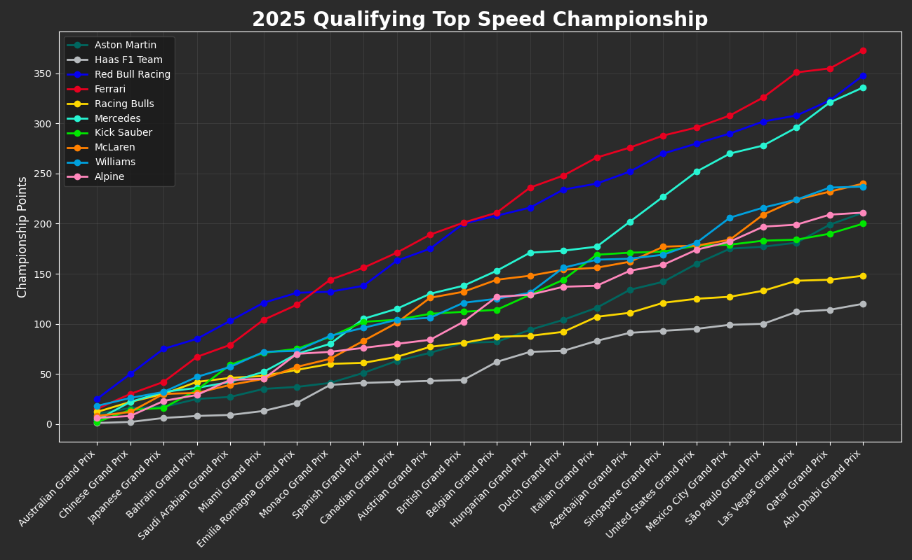
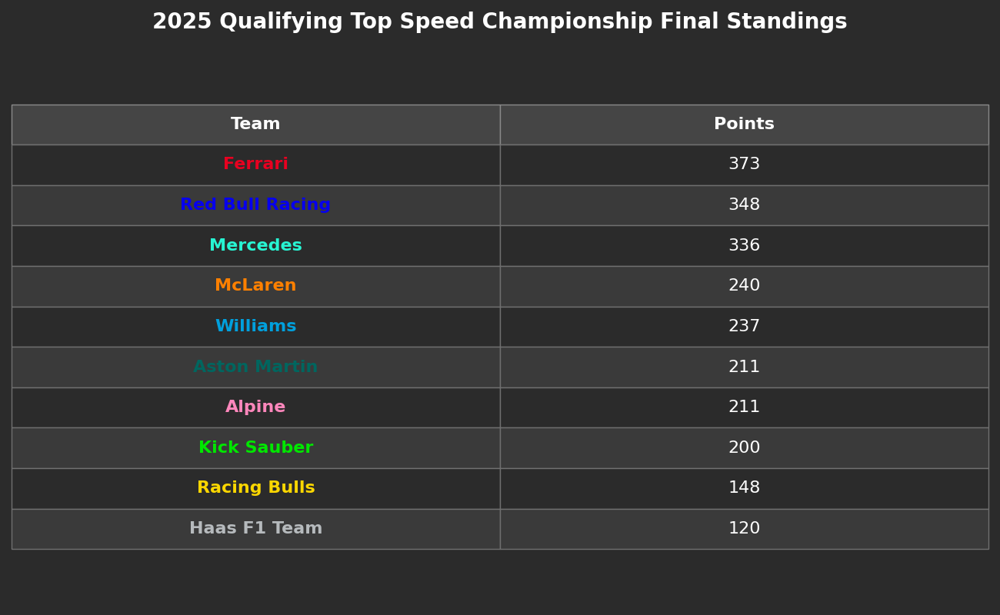
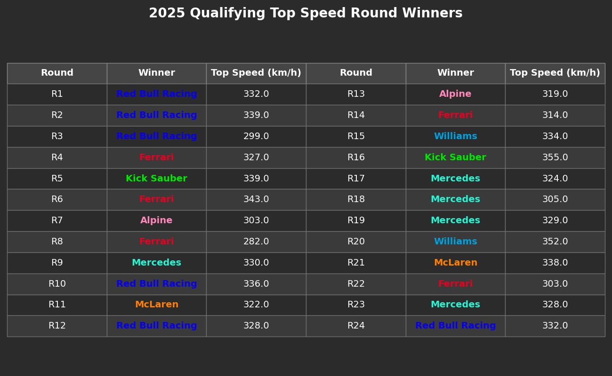

# 🏁 Qualifying Top Speed Championship

> *"Aerodynamics are for people who can't build engines."* — Enzo Ferrari

What if the Formula 1 championship were decided purely on outright top speed? This project reimagines the **2025 season** as a "Top Speed Championship," using only qualifying session data to rank teams by raw straight-line pace.

## 📊 Concept

Instead of race results, this analysis pulls the **highest speed trap reading recorded by each team** (not driver) during every Grand Prix qualifying session. Qualifying data is used specifically to avoid the tow effects that can distort speed readings during races.

Teams are then ranked at each round and awarded points using the standard F1 scoring system:

| Position | 1st | 2nd | 3rd | 4th | 5th | 6th | 7th | 8th | 9th | 10th |
|---|---|---|---|---|---|---|---|---|---|---|
| Points | 25 | 18 | 15 | 12 | 10 | 8 | 6 | 4 | 2 | 1 |

Those points are accumulated across the season to produce a full alternate championship standings, round-by-round winners, and a progression chart.

## 🏆 Results — 2025 Season

**Ferrari takes the Top Speed Championship**, finishing on 373 points,  a 25-point margin over Red Bull Racing (348), with Mercedes close behind in 3rd (336). Those three pulled clear of the rest of the grid early and never looked back; 4th-placed McLaren finished 133 points adrift on 240.

A few things stand out in the data:

- **Red Bull started the season on top**, winning 3 of the first 4 rounds (Australia, China, Japan) before Ferrari caught and passed them by the Emilia Romagna/Monaco stretch — and stayed ahead the rest of the way.
- **Mercedes made the biggest late-season move** of any team, visibly steepening their points climb from the Italian GP through Singapore and closing what had been a wide gap to 2nd place.
- **Kick Sauber posted the single fastest qualifying speed of the entire season** — 355.0 km/h at the Italian GP (Round 16) yet still finished only 8th overall on 200 points. A reminder that winning one round outright and stacking points consistently are two different things.
- **Ferrari's title wasn't built on the single fastest lap of each round** — some of their round wins came in at relatively modest speeds (e.g. 282.0 km/h at Round 8, 303.0 km/h at Round 22), meaning their lead came from consistently winning rounds rather than always setting the outright fastest number.
- **Aston Martin and Alpine tied on 211 points**, finishing level in the standings.
- **McLaren's story is the most interesting relative to reality**: despite winning the real Constructors' Championship, they rarely topped the speed trap; a direct trade-off of the MCL39's high-downforce design, which cost it outright straight-line speed in exchange for cornering performance.
- **Haas and Racing Bulls** were detached from the pack all year, the two most drag-limited cars of the season by this metric.

### Championship Progression
A round-by-round look at how the standings evolved. Ferrari and Red Bull battled for the lead most of the season, with Mercedes staging a strong late-season charge.



### Final Standings
Ferrari takes the "Top Speed Championship" title, with Haas finishing last, a reflection of their car being among the most draggy on the grid.



### Round-by-Round Winners
Which team topped the speed trap at every single Grand Prix of the season.



## 🔍 Key Takeaway

Despite winning the actual 2025 Constructors' Championship, **McLaren rarely topped the speed trap**. The MCL39's exceptional downforce came at the cost of straight-line speed — a reminder that top speed is only one piece of the F1 performance puzzle, and that the fastest car on paper isn't always the fastest car on the day.

## ⚙️ How It Works

The script (`analysis4.py`) uses [FastF1](https://github.com/theOehrly/Fast-F1) to:

1. Pull the full event schedule for a given year (`2025` by default).
2. Load every qualifying (`Q`) session.
3. Find each team's fastest `SpeedST` (speed trap) lap.
4. Rank teams per round and assign championship points.
5. Track cumulative points across the season.
6. Generate three visualizations:
   - Final standings table (top 10)
   - Round-by-round winners table
   - Championship points progression line chart

## 🛠️ Requirements

- Python 3.9+
- [`fastf1`](https://pypi.org/project/fastf1/)
- `pandas`
- `matplotlib`

Install dependencies:

```bash
pip install fastf1 pandas matplotlib
```

## ▶️ Usage

```bash
python analysis4.py
```

Data is cached locally (in `fastf1_cache/`) to speed up repeated runs. To analyze a different season, just change the `year` variable at the top of the script.

## 📁 Files

| File | Description |
|---|---|
| `analysis4.py` | Main analysis script |
| `analysis4pic1.png` | Championship progression chart |
| `analysis4pic2.png` | Final standings table |
| `analysis4pic3.png` | Round-by-round winners table |

## 📌 Notes

- Points are calculated purely from qualifying top speed and have no bearing on the real-world championship.
- Team colors in the charts/tables are pulled from FastF1's team color utilities.
- This is a fun exploratory data project, top speed is just one variable in the much larger picture of F1 performance.

---

Built with [FastF1](https://github.com/theOehrly/Fast-F1) 🐍 | `#F1DataAnalysis`
